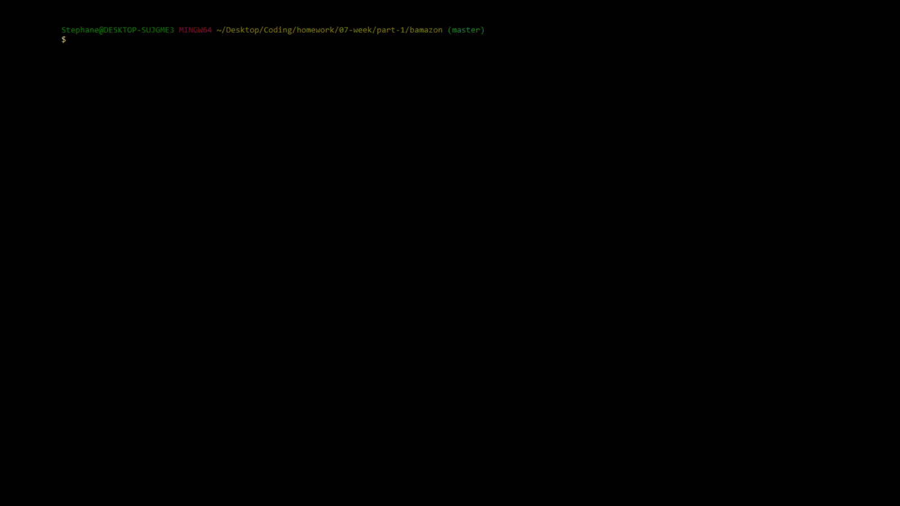
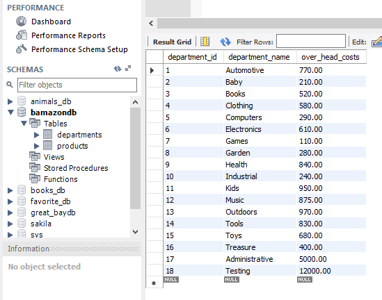

# BAMazon!
In this activity, we'll be creating an Amazon-like storefront with the MySQL skills we learned this unit. The app will take in orders from customers and deplete stock from the store's inventory. As a bonus task, we can program our app to track product sales across our store's departments and then provide a summary of the highest-grossing departments in the store.

## Usage Guide

### Challenge #1: Customer View (Minimum Requirement)

You can launch the program by entering `node bamazonCustomer.js` into your terminal shell.

Upon launching, the program will display all items, including their `item_id`, `product_name`, `department_name`, `price`, `stock_quantity`, and `product_sales`.

You will then be prompted to enter the Item ID of the product you'd like to purchase, followed by the desired quantity.

* NOTE: You must enter a numerical value greater than zero for both inputs, otherwise you will be given an error message and be prompted again.

Once your transaction is complete, you have the option to `Return to home` and begin the process anew, or to `Exit program` and terminate the process.

See the video below for a step-by-step guide for bamazonCustomer.js:

### Challenge #2: Manager View (Next Level)

You can launch the program by entering `node bamazonManager.js` into your terminal shell.

Upon launching, the program will prompt you to either `View Products for Sale`, `View Low Inventory`, `Add to Inventory`, or `Add New Product`.

While `View Products for Sale` will display all items, `View Low Inventory` will filter results to only display items with less than 10 quantity.

You also have the option to add inventory to specific products using their `Item ID` and the desired quantity, as well as to add new products altogether. The program will prompt you for the `Product Name`, `Department Name`, `Price per Unit`, and `Stock Quantity`.

Once you've finished, you again have the option to `Return to home` and begin the process anew, or to `Exit program` and terminate the process.

See the video below for a step-by-step guide for bamazonManager.js:

### Challenge #3: Supervisor View (Final Level)

You can launch the program by entering `node bamazonSupervisor.js` into your terminal shell.

Upon launching, the program will prompt you to either `View Product Sales by Department`, or `Create New Department`.

If you select `View Product Sales by Department`, the program will display all departments, including their `Overhead Costs`, and proceed to calculate their `Department Sales` based on all the products belonging to each department, and finally their `Total Profit`. 

If you select `Create New Department`, you will be prompted to enter the new `Department Name`, as well as its `Overhead Cost`.

See the video below for a step-by-step guide for bamazonSupervisor.js:

* NOTE: I currently cannot get newly added departments to appear in the `View Product Sales by Department`, although they do appear and are added to the database, as seen in the image below:

eg: (17 - Administrative - 5000.00) and (18 - Testing - 12000.00)